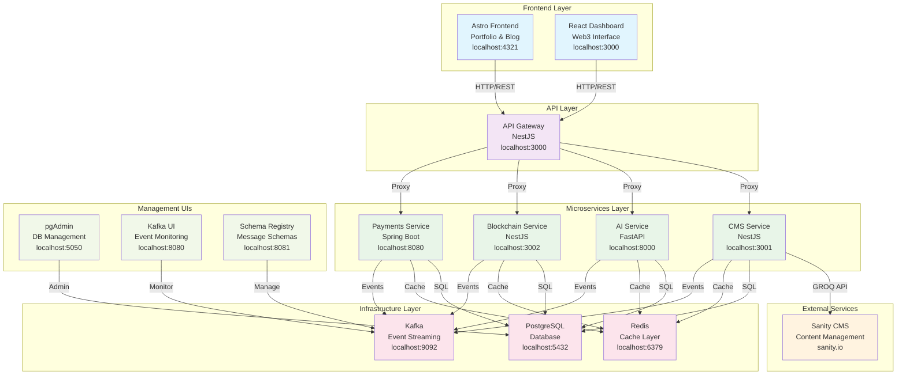
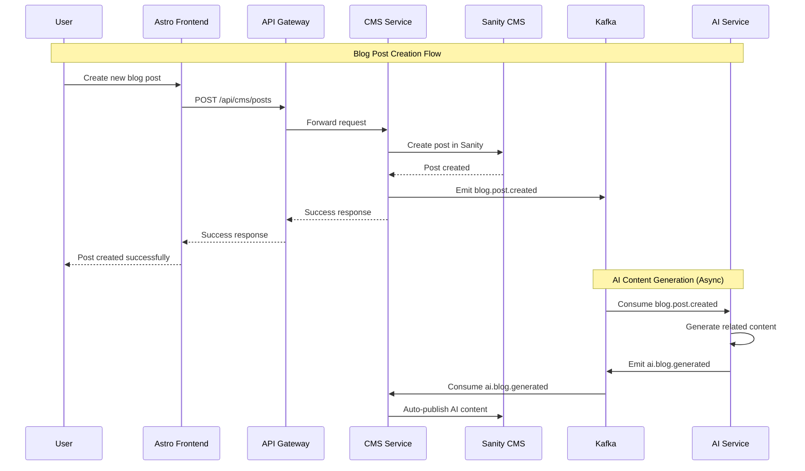
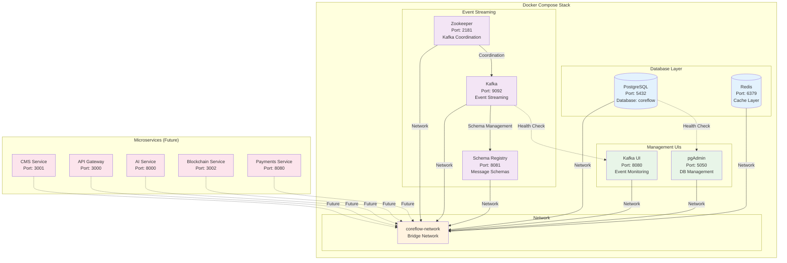
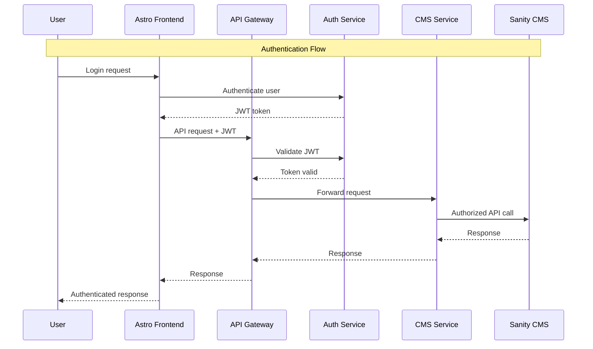
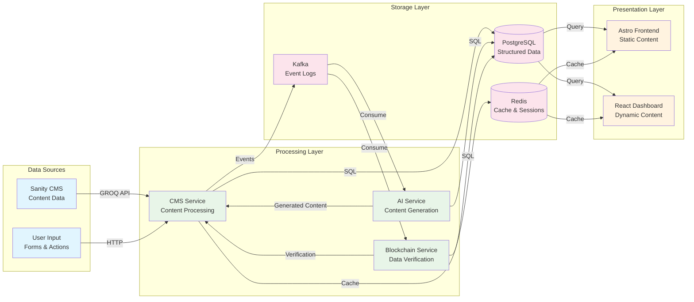
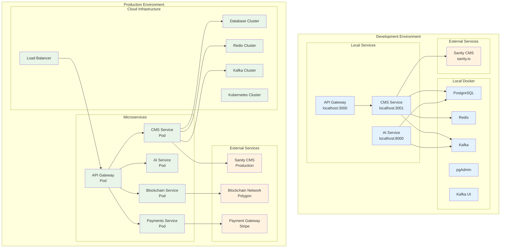
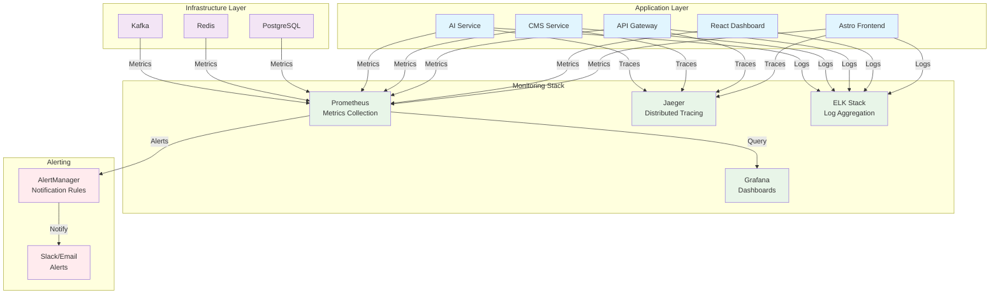

# 🏗️ CoreFlow Architecture Diagrams

This document contains Mermaid diagrams showing the CoreFlow system architecture from different perspectives.

## 📊 Diagram 1: Overall System Architecture

## 🔄 Diagram 2: Event-Driven Flow

## 🏗️ Diagram 3: Infrastructure Components

## 🔐 Diagram 4: Security & Authentication Flow

## 📊 Diagram 5: Data Flow Architecture

## 🚀 Diagram 6: Deployment Architecture

## 📈 Diagram 7: Monitoring & Observability

## 🛠️ How to Use These Diagrams

### Online Tools
1. **Mermaid Live Editor**: https://mermaid.live/
2. **GitHub/GitLab**: Paste the code in markdown files
3. **VS Code**: Install Mermaid extension

### Local Tools
1. **VS Code**: Install "Mermaid Preview" extension
2. **Obsidian**: Native Mermaid support
3. **Notion**: Supports Mermaid diagrams

### Export Options
- PNG/SVG from Mermaid Live Editor
- PDF from VS Code with Mermaid extension
- Interactive diagrams in GitHub/GitLab

---

**Last Updated:** October 15, 2024  
**Maintainer:** Jean Pierre Farfan Suarez (jeanferfs30@gmail.com)
