# 🎯 CoreFlow: Current vs Target Architecture

## 📊 Current State (What We Have Now)

```mermaid
graph TB
    subgraph "✅ COMPLETED"
        A[Astro Frontend<br/>Portfolio + Blog<br/>localhost:4321]
        S[Sanity Studio<br/>Content Management<br/>sanity.io]
        I[Infrastructure<br/>Docker Compose<br/>PostgreSQL + Redis + Kafka]
    end
    
    subgraph "❌ MISSING"
        G[API Gateway<br/>NestJS<br/>localhost:3000]
        C[CMS Service<br/>NestJS<br/>localhost:3001]
        AI[AI Service<br/>FastAPI<br/>localhost:8000]
        B[Blockchain Service<br/>NestJS<br/>localhost:3002]
        P[Payments Service<br/>Spring Boot<br/>localhost:8080]
    end
    
    %% Current direct connection
    A -->|Direct API Calls| S
    
    %% Missing microservices layer
    A -.->|Should go through| G
    G -.->|Should proxy to| C
    C -.->|Should wrap| S
    
    %% Styling
    classDef completed fill:#c8e6c9
    classDef missing fill:#ffcdd2
    classDef direct fill:#fff3e0
    classDef should fill:#e1f5fe
    
    class A,S,I completed
    class G,C,AI,B,P missing
    class A-->S direct
    class A-.->G,G-.->C,C-.->S should
```

## 🎯 Target State (What We're Building)


## 🔄 Migration Path


## 📈 Progress Tracking


### Detailed Progress

| Component | Status | Progress | Next Steps |
|-----------|--------|----------|------------|
| **Infrastructure** | ✅ Complete | 100% | Ready for microservices |
| **Astro Frontend** | ✅ Complete | 100% | Ready for API Gateway integration |
| **Sanity Studio** | ✅ Complete | 100% | Ready for CMS Service integration |
| **CMS Service** | 🔄 Next | 0% | Start NestJS development |
| **API Gateway** | ⏳ Pending | 0% | After CMS Service |
| **AI Service** | ⏳ Pending | 0% | Phase 3 |
| **Blockchain Service** | ⏳ Pending | 0% | Phase 4 |
| **Payments Service** | ⏳ Pending | 0% | Phase 5 |

## 🚧 Current Blockers

```mermaid
graph LR
    subgraph "Critical Blockers"
        B1[Infrastructure Ready ✅]
        B2[CMS Service Missing ❌]
        B3[API Gateway Missing ❌]
    end
    
    subgraph "Dependencies"
        D1[Frontend needs API Gateway]
        D2[API Gateway needs CMS Service]
        D3[CMS Service needs Infrastructure]
    end
    
    B1 --> D3
    D3 --> B2
    B2 --> D2
    D2 --> B3
    B3 --> D1
    
    %% Styling
    classDef blocker fill:#ffcdd2
    classDef dependency fill:#fff3e0
    classDef ready fill:#c8e6c9
    
    class B2,B3 blocker
    class D1,D2,D3 dependency
    class B1 ready
```



## 🎯 Next Immediate Actions


## 📊 Architecture Comparison

| Aspect | Current State | Target State | Gap |
|--------|---------------|--------------|-----|
| **Frontend** | Direct Sanity calls | API Gateway calls | Need Gateway |
| **Backend** | No microservices | 5 microservices | Need all services |
| **Events** | No event system | Kafka event-driven | Need Kafka integration |
| **Auth** | No authentication | JWT + OAuth2 | Need auth system |
| **Monitoring** | Basic logging | Full observability | Need monitoring stack |
| **Deployment** | Local only | K8s production | Need deployment pipeline |

---

**Last Updated:** October 15, 2024  
**Status:** Infrastructure Complete, Ready for CMS Service Development
