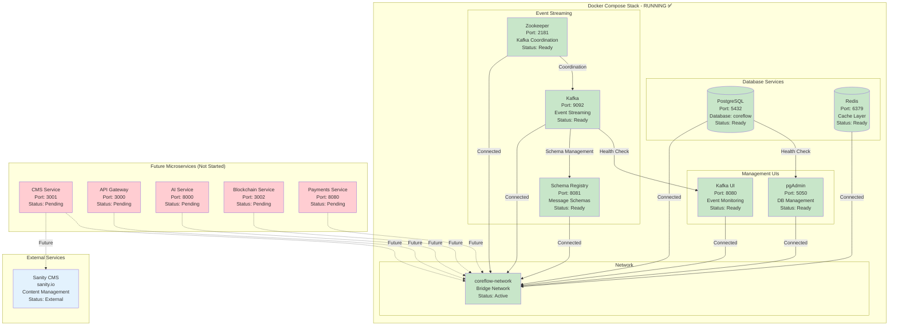
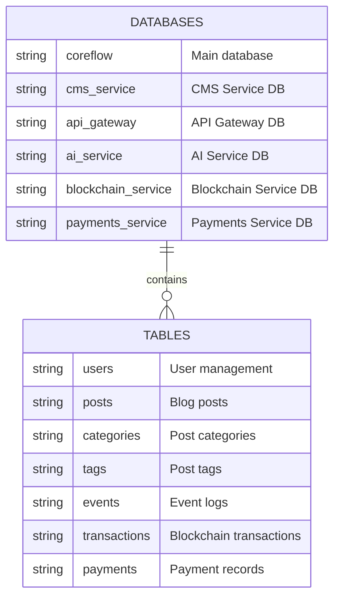
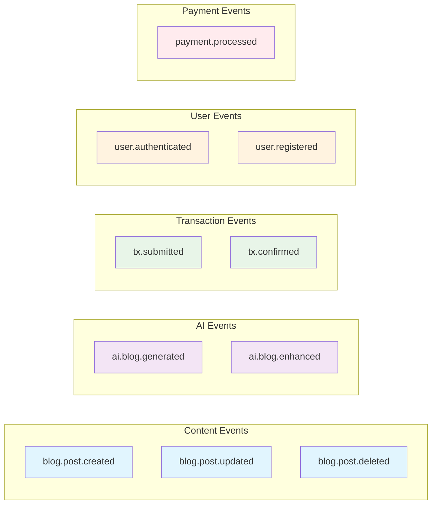

# 🏗️ CoreFlow Infrastructure Overview

## 📊 Current Infrastructure Status



## 🔌 Service Endpoints

| Service | Port | URL | Credentials | Purpose |
|---------|------|-----|-------------|---------|
| **PostgreSQL** | 5432 | `localhost:5432` | `coreflow/coreflow123` | Primary database |
| **Redis** | 6379 | `localhost:6379` | No auth | Cache layer |
| **Kafka** | 9092 | `localhost:9092` | No auth | Event streaming |
| **Zookeeper** | 2181 | `localhost:2181` | No auth | Kafka coordination |
| **pgAdmin** | 5050 | http://localhost:5050 | `admin@coreflow.dev/admin123` | DB management |
| **Kafka UI** | 8080 | http://localhost:8080 | No auth | Event monitoring |
| **Schema Registry** | 8081 | http://localhost:8081 | No auth | Message schemas |

## 📊 Database Schema



## 🔄 Kafka Topics (Auto-created)



## 🚀 Quick Start Commands

### Start Infrastructure
```bash
# Option 1: Use startup script
cd infra
./start.sh          # Linux/Mac
start.bat           # Windows

# Option 2: Manual Docker Compose
cd infra
docker-compose up -d
```

### Verify Services
```bash
# Check all services
docker-compose ps

# Check specific service logs
docker-compose logs -f postgres
docker-compose logs -f kafka
docker-compose logs -f redis

# Test connections
docker exec coreflow-postgres pg_isready -U coreflow
docker exec coreflow-redis redis-cli ping
docker exec coreflow-kafka kafka-broker-api-versions --bootstrap-server localhost:9092
```

### Stop Infrastructure
```bash
# Stop all services
docker-compose down

# Stop and remove volumes (WARNING: Deletes all data)
docker-compose down -v
```

## 🔧 Troubleshooting

### Common Issues

| Issue | Solution |
|-------|----------|
| **Port already in use** | Check if another service is using the port: `netstat -tulpn \| grep :5432` |
| **Docker not running** | Start Docker Desktop and wait for it to be ready |
| **Services not starting** | Check logs: `docker-compose logs [service-name]` |
| **Database connection failed** | Wait 30 seconds for PostgreSQL to fully initialize |
| **Kafka not ready** | Wait for Zookeeper to be ready first, then Kafka |

### Health Checks

```bash
# PostgreSQL
docker exec coreflow-postgres pg_isready -U coreflow

# Redis
docker exec coreflow-redis redis-cli ping

# Kafka
docker exec coreflow-kafka kafka-broker-api-versions --bootstrap-server localhost:9092

# All services status
docker-compose ps
```

## 📈 Resource Usage

### Default Resource Allocation

| Service | CPU | Memory | Storage |
|---------|-----|--------|---------|
| PostgreSQL | 0.5 cores | 512MB | 1GB |
| Redis | 0.1 cores | 128MB | 100MB |
| Kafka | 0.5 cores | 512MB | 1GB |
| Zookeeper | 0.2 cores | 256MB | 100MB |
| pgAdmin | 0.1 cores | 128MB | 50MB |
| Kafka UI | 0.1 cores | 128MB | 50MB |
| Schema Registry | 0.1 cores | 128MB | 50MB |

### Monitoring Commands

```bash
# View resource usage
docker stats

# View disk usage
docker system df

# Clean up unused resources
docker system prune
```

## 🔐 Security Notes

### Current Security Status
- ✅ **Network isolation** with Docker bridge network
- ✅ **No external exposure** (all services on localhost)
- ✅ **Default credentials** for development only
- ⚠️ **Production setup needed** for deployment

### Security Checklist for Production
- [ ] Change default passwords
- [ ] Enable SSL/TLS encryption
- [ ] Configure firewall rules
- [ ] Set up proper authentication
- [ ] Enable audit logging
- [ ] Regular security updates

---

**Last Updated:** October 15, 2024  
**Status:** Infrastructure Complete and Running  
**Next Step:** Start CMS Service Development
