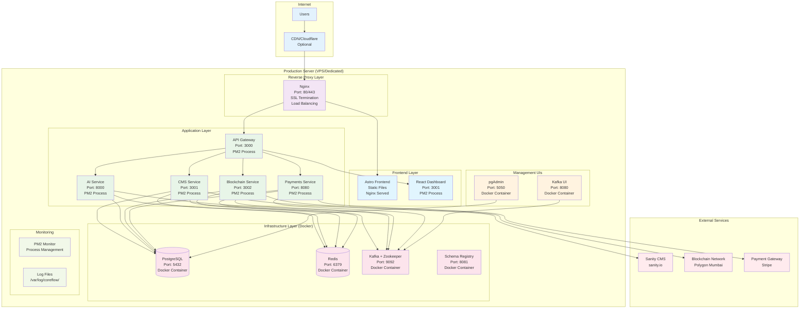
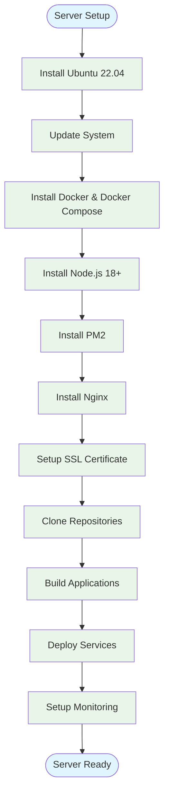

# 🖥️ CoreFlow Server Deployment Architecture

## 📊 Production Server Architecture



## 🏗️ Server Requirements

### **Minimum Server Specs**
| Component | Minimum | Recommended | Production |
|-----------|---------|-------------|------------|
| **CPU** | 2 cores | 4 cores | 8+ cores |
| **RAM** | 4GB | 8GB | 16GB+ |
| **Storage** | 50GB SSD | 100GB SSD | 500GB+ SSD |
| **Network** | 100 Mbps | 1 Gbps | 10 Gbps |
| **OS** | Ubuntu 20.04+ | Ubuntu 22.04+ | Ubuntu 22.04+ |

### **Recommended VPS Providers**
- **DigitalOcean**: Droplet 4GB+ ($24/month)
- **Linode**: Nanode 4GB+ ($20/month)
- **Vultr**: High Frequency 4GB+ ($24/month)
- **Hetzner**: CX21 4GB+ (€4.15/month)

## 🔧 Server Setup Process



## 📁 Server Directory Structure

```
/opt/coreflow/
├── apps/
│   ├── api-gateway/
│   ├── cms-service/
│   ├── ai-service/
│   ├── blockchain-service/
│   ├── payments-service/
│   ├── coreflow-astro/
│   └── coreflow-dashboard/
├── infra/
│   ├── docker-compose.yml
│   ├── nginx/
│   │   ├── nginx.conf
│   │   └── sites-available/
│   └── ssl/
├── logs/
│   ├── api-gateway.log
│   ├── cms-service.log
│   ├── ai-service.log
│   └── nginx/
├── scripts/
│   ├── deploy.sh
│   ├── backup.sh
│   └── monitor.sh
└── .env
```

## 🌐 Nginx Configuration

### **Main Nginx Config** (`/etc/nginx/nginx.conf`)
```nginx
user www-data;
worker_processes auto;
pid /run/nginx.pid;

events {
    worker_connections 1024;
    use epoll;
    multi_accept on;
}

http {
    include /etc/nginx/mime.types;
    default_type application/octet-stream;
    
    # Logging
    log_format main '$remote_addr - $remote_user [$time_local] "$request" '
                    '$status $body_bytes_sent "$http_referer" '
                    '"$http_user_agent" "$http_x_forwarded_for"';
    
    access_log /var/log/nginx/access.log main;
    error_log /var/log/nginx/error.log;
    
    # Gzip compression
    gzip on;
    gzip_vary on;
    gzip_min_length 1024;
    gzip_types text/plain text/css application/json application/javascript text/xml application/xml application/xml+rss text/javascript;
    
    # Rate limiting
    limit_req_zone $binary_remote_addr zone=api:10m rate=10r/s;
    limit_req_zone $binary_remote_addr zone=login:10m rate=1r/s;
    
    # Include site configs
    include /etc/nginx/sites-enabled/*;
}
```

### **CoreFlow Site Config** (`/etc/nginx/sites-available/coreflow`)
```nginx
server {
    listen 80;
    server_name yourdomain.com www.yourdomain.com;
    return 301 https://$server_name$request_uri;
}

server {
    listen 443 ssl http2;
    server_name yourdomain.com www.yourdomain.com;
    
    # SSL Configuration
    ssl_certificate /etc/ssl/certs/coreflow.crt;
    ssl_certificate_key /etc/ssl/private/coreflow.key;
    ssl_protocols TLSv1.2 TLSv1.3;
    ssl_ciphers ECDHE-RSA-AES256-GCM-SHA512:DHE-RSA-AES256-GCM-SHA512:ECDHE-RSA-AES256-GCM-SHA384:DHE-RSA-AES256-GCM-SHA384;
    ssl_prefer_server_ciphers off;
    
    # Security headers
    add_header X-Frame-Options DENY;
    add_header X-Content-Type-Options nosniff;
    add_header X-XSS-Protection "1; mode=block";
    add_header Strict-Transport-Security "max-age=31536000; includeSubDomains" always;
    
    # Frontend (Astro)
    location / {
        root /opt/coreflow/apps/coreflow-astro/dist;
        try_files $uri $uri/ /index.html;
        
        # Cache static assets
        location ~* \.(js|css|png|jpg|jpeg|gif|ico|svg)$ {
            expires 1y;
            add_header Cache-Control "public, immutable";
        }
    }
    
    # API Gateway
    location /api/ {
        limit_req zone=api burst=20 nodelay;
        proxy_pass http://localhost:3000;
        proxy_http_version 1.1;
        proxy_set_header Upgrade $http_upgrade;
        proxy_set_header Connection 'upgrade';
        proxy_set_header Host $host;
        proxy_set_header X-Real-IP $remote_addr;
        proxy_set_header X-Forwarded-For $proxy_add_x_forwarded_for;
        proxy_set_header X-Forwarded-Proto $scheme;
        proxy_cache_bypass $http_upgrade;
    }
    
    # Dashboard (React)
    location /dashboard {
        proxy_pass http://localhost:3001;
        proxy_http_version 1.1;
        proxy_set_header Upgrade $http_upgrade;
        proxy_set_header Connection 'upgrade';
        proxy_set_header Host $host;
        proxy_set_header X-Real-IP $remote_addr;
        proxy_set_header X-Forwarded-For $proxy_add_x_forwarded_for;
        proxy_set_header X-Forwarded-Proto $scheme;
        proxy_cache_bypass $http_upgrade;
    }
    
    # Management UIs (Restricted)
    location /pgadmin {
        allow 192.168.1.0/24;  # Only local network
        allow 10.0.0.0/8;      # Only local network
        deny all;
        proxy_pass http://localhost:5050;
    }
    
    location /kafka-ui {
        allow 192.168.1.0/24;  # Only local network
        allow 10.0.0.0/8;      # Only local network
        deny all;
        proxy_pass http://localhost:8080;
    }
}
```

## 🚀 Deployment Scripts

### **Deploy Script** (`scripts/deploy.sh`)
```bash
#!/bin/bash
# CoreFlow Deployment Script

set -e

echo "🚀 Starting CoreFlow deployment..."

# Update system
sudo apt update && sudo apt upgrade -y

# Install dependencies
sudo apt install -y curl wget git nginx certbot python3-certbot-nginx

# Install Docker
curl -fsSL https://get.docker.com -o get-docker.sh
sudo sh get-docker.sh
sudo usermod -aG docker $USER

# Install Docker Compose
sudo curl -L "https://github.com/docker/compose/releases/latest/download/docker-compose-$(uname -s)-$(uname -m)" -o /usr/local/bin/docker-compose
sudo chmod +x /usr/local/bin/docker-compose

# Install Node.js
curl -fsSL https://deb.nodesource.com/setup_18.x | sudo -E bash -
sudo apt-get install -y nodejs

# Install PM2
sudo npm install -g pm2

# Create directories
sudo mkdir -p /opt/coreflow/{apps,infra,logs,scripts}
sudo chown -R $USER:$USER /opt/coreflow

# Clone repositories
cd /opt/coreflow/apps
git clone https://github.com/JeanFSZ/core-flow-ws-cms-service.git cms-service
git clone https://github.com/JeanFSZ/core-flow-ws-api-gateway.git api-gateway
# ... clone other repos

# Setup environment
cp /opt/coreflow/infra/env.example /opt/coreflow/.env
nano /opt/coreflow/.env  # Edit environment variables

# Start infrastructure
cd /opt/coreflow/infra
docker-compose up -d

# Build and start services
cd /opt/coreflow/apps
for service in api-gateway cms-service ai-service blockchain-service payments-service; do
    cd $service
    npm install
    npm run build
    pm2 start ecosystem.config.js
    cd ..
done

# Setup Nginx
sudo cp /opt/coreflow/infra/nginx/coreflow /etc/nginx/sites-available/
sudo ln -s /etc/nginx/sites-available/coreflow /etc/nginx/sites-enabled/
sudo nginx -t
sudo systemctl reload nginx

# Setup SSL
sudo certbot --nginx -d yourdomain.com

echo "✅ CoreFlow deployment completed!"
```

### **PM2 Ecosystem** (`ecosystem.config.js`)
```javascript
module.exports = {
  apps: [
    {
      name: 'api-gateway',
      script: 'dist/main.js',
      cwd: '/opt/coreflow/apps/api-gateway',
      instances: 2,
      exec_mode: 'cluster',
      env: {
        NODE_ENV: 'production',
        PORT: 3000
      },
      log_file: '/opt/coreflow/logs/api-gateway.log',
      error_file: '/opt/coreflow/logs/api-gateway-error.log',
      out_file: '/opt/coreflow/logs/api-gateway-out.log'
    },
    {
      name: 'cms-service',
      script: 'dist/main.js',
      cwd: '/opt/coreflow/apps/cms-service',
      instances: 2,
      exec_mode: 'cluster',
      env: {
        NODE_ENV: 'production',
        PORT: 3001
      },
      log_file: '/opt/coreflow/logs/cms-service.log',
      error_file: '/opt/coreflow/logs/cms-service-error.log',
      out_file: '/opt/coreflow/logs/cms-service-out.log'
    }
    // ... other services
  ]
};
```

## 📊 Monitoring & Maintenance

### **Health Check Script** (`scripts/health-check.sh`)
```bash
#!/bin/bash
# CoreFlow Health Check

echo "🔍 Checking CoreFlow services..."

# Check Docker services
docker-compose ps

# Check PM2 processes
pm2 status

# Check Nginx
sudo systemctl status nginx

# Check disk space
df -h

# Check memory usage
free -h

# Check logs for errors
tail -n 50 /opt/coreflow/logs/*.log | grep -i error
```

### **Backup Script** (`scripts/backup.sh`)
```bash
#!/bin/bash
# CoreFlow Backup Script

BACKUP_DIR="/opt/backups/coreflow"
DATE=$(date +%Y%m%d_%H%M%S)

mkdir -p $BACKUP_DIR

# Backup database
docker exec coreflow-postgres pg_dump -U coreflow coreflow > $BACKUP_DIR/database_$DATE.sql

# Backup application files
tar -czf $BACKUP_DIR/apps_$DATE.tar.gz /opt/coreflow/apps

# Backup logs
tar -czf $BACKUP_DIR/logs_$DATE.tar.gz /opt/coreflow/logs

# Clean old backups (keep last 7 days)
find $BACKUP_DIR -name "*.sql" -mtime +7 -delete
find $BACKUP_DIR -name "*.tar.gz" -mtime +7 -delete

echo "✅ Backup completed: $BACKUP_DIR"
```

## 🔐 Security Considerations

### **Firewall Setup**
```bash
# UFW Firewall
sudo ufw enable
sudo ufw allow 22/tcp    # SSH
sudo ufw allow 80/tcp    # HTTP
sudo ufw allow 443/tcp   # HTTPS
sudo ufw deny 3000:8080/tcp  # Block direct access to microservices
```

### **SSL Certificate**
```bash
# Let's Encrypt SSL
sudo certbot --nginx -d yourdomain.com -d www.yourdomain.com
sudo certbot renew --dry-run  # Test renewal
```

### **Regular Updates**
```bash
# Weekly update script
sudo apt update && sudo apt upgrade -y
docker-compose pull
docker-compose up -d
pm2 reload all
```

---

**Last Updated:** October 15, 2024  
**Server Type:** VPS/Dedicated Server  
**OS:** Ubuntu 22.04+  
**Deployment:** Docker Compose + PM2 + Nginx
